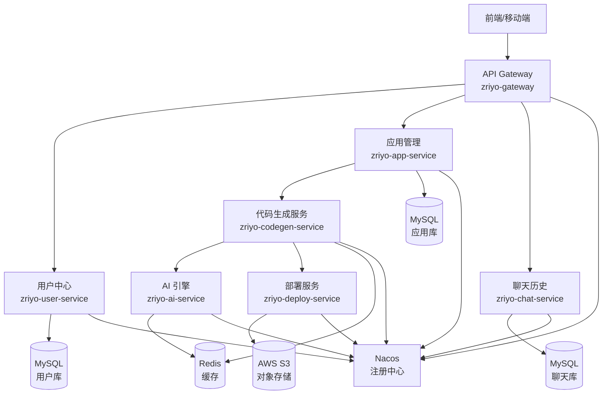

# ZriyoCode 微服务架构拆分方案

> **文档说明**：本文档为 ZriyoCode AI 零代码生成平台从单体架构向 Spring Cloud Alibaba 微服务架构迁移的完整技术设计方案。

## 一、现状分析

### 1.1 当前架构

ZriyoCode 目前是一个基于 **Spring Boot 3 + Java 21** 的单体应用，核心模块包括：

```
zriyo-ai-code-mother (单体)
├── ai/              # AI 相关服务（LangChain4j、Prompt）
├── controller/      # REST API 控制器
├── service/         # 业务逻辑层
├── mapper/          # 数据访问层（MyBatis-Flex）
├── core/            # 核心引擎（责任链、Pipeline）
├── model/           # 实体类、DTO、VO
├── config/          # 配置类
├── util/            # 工具类
└── oos/             # 对象存储服务
```

### 1.2 核心业务流程

1.  **用户管理**：注册、登录、积分系统
2.  **AI 代码生成**：需求分析 → 骨架生成 → 文件生成 → 代码生成 → 构建打包
3.  **应用管理**：应用 CRUD、版本管理
4.  **部署服务**：自动化部署、版本回滚
5.  **聊天历史**：对话记录、工具调用日志

### 1.3 当前痛点

- ❌ **扩展性不足**：AI 生成服务与用户服务耦合，无法独立扩容
- ❌ **资源竞争**：AI 调用（CPU 密集）与 Web 请求（IO 密集）抢占同一 JVM 资源
- ❌ **技术绑定**：无法针对不同服务选择最优技术栈（如 AI 服务用 Python）
- ❌ **故障隔离差**：任一模块崩溃可能导致整个系统不可用

---

## 二、微服务拆分方案

### 2.1 服务划分原则

遵循 **领域驱动设计（DDD）** 和 **单一职责原则**，按业务边界拆分：

| 服务名称 | 职责 | 核心业务 |
|---------|------|---------|
| `zriyo-gateway` | API 网关 | 统一入口、路由、鉴权、限流 |
| `zriyo-user-service` | 用户中心 | 用户注册/登录、积分管理、认证授权 |
| `zriyo-ai-service` | AI 核心引擎 | LLM 调用、Prompt 管理、骨架生成 |
| `zriyo-codegen-service` | 代码生成服务 | 责任链编排、文件生成、代码写入 |
| `zriyo-app-service` | 应用管理服务 | 应用 CRUD、版本管理、元数据存储 |
| `zriyo-deploy-service` | 部署服务 | Playwright 自动化、S3 上传、版本归档 |
| `zriyo-chat-service` | 聊天历史服务 | 对话记录、工具日志、上下文管理 |
| `zriyo-common` | 公共模块 | 实体类、工具类、常量 |

### 2.2 服务拓扑图



---

## 三、Spring Cloud Alibaba 技术栈选型

### 3.1 核心组件

| 组件 | 技术选型 | 作用 | 版本 |
|-----|---------|------|------|
| **服务注册与发现** | Nacos | 服务注册中心、配置中心 | 2.3.x |
| **配置管理** | Nacos Config | 动态配置、配置热更新 | 2.3.x |
| **服务调用** | Dubbo 3 / OpenFeign | RPC 框架 | Dubbo 3.2.x |
| **负载均衡** | Spring Cloud LoadBalancer | 客户端负载均衡 | - |
| **API 网关** | Spring Cloud Gateway | 统一网关、路由、过滤 | 4.1.x |
| **限流熔断** | Sentinel | 流量控制、熔断降级 | 1.8.x |
| **链路追踪** | SkyWalking / Zipkin | 分布式链路追踪 | - |
| **消息队列** | RocketMQ | 异步解耦、削峰填谷、最终一致性 | 5.x |

### 3.2 技术栈版本对照表

```xml
<!-- Spring Cloud Alibaba 版本管理 -->
<dependencyManagement>
    <dependencies>
        <dependency>
            <groupId>org.springframework.boot</groupId>
            <artifactId>spring-boot-dependencies</artifactId>
            <version>3.2.0</version>
            <type>pom</type>
            <scope>import</scope>
        </dependency>
        <dependency>
            <groupId>com.alibaba.cloud</groupId>
            <artifactId>spring-cloud-alibaba-dependencies</artifactId>
            <version>2023.0.1.0</version>
            <type>pom</type>
            <scope>import</scope>
        </dependency>
    </dependencies>
</dependencyManagement>
```

---

## 四、详细拆分方案

### 4.1 API 网关 (`zriyo-gateway`)

**职责**：
- 统一入口管理（所有外部请求先到网关）
- 路由分发（根据 URL 路由到对应微服务）
- 鉴权认证（集成 Sa-Token，验证 JWT）
- 全局限流（基于 Sentinel）
- 跨域处理

**技术栈**：
- Spring Cloud Gateway
- Sa-Token（鉴权）
- Sentinel（限流）
- Nacos（动态路由配置）

**核心配置示例**：
```yaml
spring:
  cloud:
    gateway:
      routes:
        - id: user-service
          uri: lb://zriyo-user-service
          predicates:
            - Path=/api/user/**
        - id: codegen-service
          uri: lb://zriyo-codegen-service
          predicates:
            - Path=/api/codegen/**
```

---

### 4.2 用户中心 (`zriyo-user-service`)

**职责**：
- 用户注册、登录、注销
- JWT Token 生成与验证
- 积分系统管理
- 微信登录集成（Authing SDK）
- 实名认证

**数据库**：独立 `zriyo_user_db`
- 表：`user`, `user_points`, `user_auth`

**对外接口**：
- `POST /api/user/register` - 用户注册
- `POST /api/user/login` - 用户登录
- `GET /api/user/profile` - 获取用户信息
- `POST /api/user/points/consume` - 消费积分

---

### 4.3 AI 引擎服务 (`zriyo-ai-service`)

**职责**：
- 大模型调用（OpenAI、通义千问等）
- Prompt Engineering（System Prompt 管理）
- 骨架生成（`SkeletonGenerateHandler` 逻辑）
- AI 响应流式处理

**技术栈**：
- LangChain4j
- Spring WebFlux（响应式）
- Redis（Prompt 缓存）

**对外接口（Dubbo/Feign）**：
- `generateSkeleton(String requirement)` - 生成项目骨架
- `chatStream(String message)` - 流式聊天

**隔离优势**：
- ✅ AI 服务可独立扩容（增加实例分担 LLM 调用压力）
- ✅ 可配置多模型路由（根据负载选择不同 LLM）

---

### 4.4 代码生成服务 (`zriyo-codegen-service`)

**职责**：
- **责任链编排**：`CodeGenPipelineBuilder` 核心逻辑
- 文件创建、代码写入、完整性检查
- 调用 AI 服务生成代码
- 调用部署服务打包

**核心流程**：
```
骨架加载 → 文件创建 → 调用 AI → 代码写入 → 完整性检查 → 触发部署
```

**依赖服务**：
- `zriyo-ai-service`（生成代码）
- `zriyo-deploy-service`（构建部署）
- `zriyo-chat-service`（保存日志）

**技术实现**：
- 责任链模式保留在此服务
- 使用 **Dubbo** 调用 AI 服务（高性能 RPC）
- 使用 **RocketMQ** 异步触发部署（解耦）

---

### 4.5 部署服务 (`zriyo-deploy-service`)

**职责**：
- Playwright 自动化构建
- 截图预览生成
- AWS S3 上传
- 版本归档与回滚

**技术栈**：
- Playwright（无头浏览器）
- AWS SDK for Java
- Docker（容器化部署）

**异步化改造**：
```java
// 使用 RocketMQ 监听部署事件
@RocketMQMessageListener(topic = "CODEGEN_BUILD_TOPIC", consumerGroup = "deploy-service")
public class DeployListener implements RocketMQListener<DeployEvent> {
    @Override
    public void onMessage(DeployEvent event) {
        // 执行 Playwright 构建
        playwrightService.buildApp(event.getAppId());
    }
}
```

---

### 4.6 应用管理服务 (`zriyo-app-service`)

**职责**：
- 应用 CRUD
- 应用元数据管理
- 版本列表查询
- 部署历史记录

**数据库**：独立 `zriyo_app_db`
- 表：`app`, `deployment_history`

---

### 4.7 聊天历史服务 (`zriyo-chat-service`)

**职责**：
- 聊天记录存储
- 工具调用日志（`AiToolLog`）
- 上下文管理

**数据库**：独立 `zriyo_chat_db`
- 表：`chat_history`, `ai_tool_log`

---

## 五、关键技术方案

### 5.1 事务一致性方案（基于 RocketMQ 最终一致性）

**场景**：用户发起代码生成 → 扣积分 → 记录聊天 → 生成代码

**原则**：移除 Seata 等重型分布式事务框架，采用**最终一致性**方案。优先保证核心业务（积分扣减 + 生成任务提交）的原子性，下游业务通过消息队列异步重试。

**方案**：本地事务 + RocketMQ 事务消息

1.  **用户服务（User Service）**：
    *   用户请求生成代码。
    *   开启事务：
        *   扣减用户积分。
        *   发送 RocketMQ 半消息（Half Message）。
        *   提交本地事务。
    *   确认发送消息（Commit）。

2.  **代码生成服务（CodeGen Service）**：
    *   订阅 RocketMQ 消息。
    *   收到消息后开始执行代码生成核心逻辑。
    *   如果执行失败，RocketMQ 会自动重试，保证**至少投递一次**。

3.  **聊天服务（Chat Service）**：
    *   订阅同一消息。
    *   异步写入聊天记录。

**核心代码示意（生产者）**：
```java
@Autowired
private RocketMQTemplate rocketMQTemplate;

@Transactional
public void createGenerationTask(Long userId, String requirement) {
    // 1. 本地业务：扣减积分
    pointMapper.deductPoints(userId, 10);
    
    // 2. 发送事务消息
    Message<String> message = MessageBuilder.withPayload(requirement).build();
    rocketMQTemplate.sendMessageInTransaction("CODEGEN_TOPIC", message, null);
}
```

### 5.2 流式响应设计（SSE 跨服务）

**挑战**：原单体的 SSE 流式响应如何在微服务中保持？

**方案**：
1. 网关支持 SSE 透传
2. `codegen-service` 调用 `ai-service` 获取流式数据
3. 使用 **Reactor Flux** 跨服务传递

```java
// AI 服务
public Flux<String> chatStream(String message) {
    return langChain4jService.streamChat(message);
}

// CodeGen 服务
public Flux<ServerSentEvent<Object>> generateWithStream(String message) {
    return aiFeignClient.chatStream(message)
        .map(chunk -> SseEventBuilder.of(StreamMessageTypeEnum.AI_RESPONSE, chunk));
}
```

### 5.3 服务间调用方案

| 场景 | 技术选型 | 理由 |
|-----|---------|------|
| 同步调用（低延迟） | Dubbo 3 | 高性能 RPC，二进制协议 |
| 异步解耦 | RocketMQ | 部署任务、截图生成、事务最终一致性 |
| 查询聚合 | OpenFeign | RESTful 风格，易调试 |

### 5.4 配置中心设计（Nacos）

**配置分层**：
```
nacos-config/
├── application-common.yml      # 公共配置（Redis、MySQL）
├── zriyo-gateway-dev.yml       # 网关开发配置
├── zriyo-ai-service-prod.yml   # AI 服务生产配置
└── ...
```

**动态刷新**：
```java
@RefreshScope
@Configuration
public class AIConfig {
    @Value("${ai.model.name}")
    private String modelName;
    
    @Value("${ai.temperature}")
    private Double temperature;
}
```

---

## 六、数据库拆分方案

### 6.1 拆分原则

- ✅ 每个微服务独立数据库（物理隔离）
- ✅ 避免跨库 JOIN（通过服务调用聚合数据）
- ✅ 公共字典表可复制到各库

### 6.2 数据库分配

| 服务 | 数据库名 | 核心表 |
|-----|---------|--------|
| `user-service` | `zriyo_user_db` | `user`, `user_points` |
| `app-service` | `zriyo_app_db` | `app`, `deployment_history` |
| `chat-service` | `zriyo_chat_db` | `chat_history`, `ai_tool_log` |

### 6.3 跨库数据查询

**场景**：查询"我的应用列表 + 每个应用的聊天记录数"

**方案**：
```java
// 1. 查询应用列表（app-service）
List<App> apps = appService.listMyApps(userId);

// 2. 批量查询聊天数（chat-service）
Map<Long, Integer> chatCounts = chatFeignClient.batchCountByAppIds(appIds);

// 3. 聚合返回
apps.forEach(app -> app.setChatCount(chatCounts.get(app.getId())));
```

---

## 七、迁移路线图

### 第一阶段：基础设施搭建（1-2周）
- [ ] 搭建 Nacos 集群
- [ ] 搭建 Sentinel Dashboard
- [ ] 搭建 SkyWalking
- [ ] 创建各微服务的数据库

### 第二阶段：核心服务拆分（2-3周）
- [ ] 拆分 `user-service`（优先级最高，其他服务依赖）
- [ ] 拆分 `ai-service`（AI 核心逻辑）
- [ ] 拆分 `codegen-service`（责任链保留）

### 第三阶段：周边服务拆分（1-2周）
- [ ] 拆分 `app-service`
- [ ] 拆分 `deploy-service`
- [ ] 拆分 `chat-service`

### 第四阶段：网关与监控（1周）
- [ ] 搭建 API Gateway
- [ ] 配置路由、鉴权、限流
- [ ] 接入链路追踪

### 第五阶段：灰度发布与压测（1周）
- [ ] 灰度发布测试
- [ ] 性能压测
- [ ] 全量切换

---

## 八、监控与运维

### 8.1 监控体系

| 维度 | 工具 | 监控内容 |
|-----|------|---------|
| 应用监控 | Spring Boot Actuator | JVM、线程、堆内存 |
| 链路追踪 | SkyWalking | 调用链路、耗时分析 |
| 业务监控 | Prometheus + Grafana | QPS、错误率、积分消费 |
| 日志收集 | ELK (Elasticsearch) | 统一日志查询 |

### 8.2 告警策略

- 🔴 **P0 告警**：服务不可用、数据库连接失败
- 🟠 **P1 告警**：接口响应时间 > 3s、错误率 > 5%
- 🟡 **P2 告警**：JVM 堆内存 > 80%、Redis 连接池耗尽

---

## 九、总结

### 9.1 微服务化收益

| 收益点 | 说明 |
|-------|------|
| **独立扩展** | AI 服务可根据负载独立扩容，不影响其他服务 |
| **技术异构** | 后续可用 Python 重写 AI 服务，其他服务不受影响 |
| **故障隔离** | 部署服务崩溃不影响用户登录 |
| **团队协作** | 不同团队可独立开发、部署各自的服务 |
| **轻量化** | 移除 Seata，采用 MQ 最终一致性，降低运维复杂度 |

### 9.2 注意事项

⚠️ **分布式复杂性**：
- 需要处理网络延迟、服务雪崩
- 消息幂等性处理（防止消息重复消费）

⚠️ **运维成本**：
- 服务数量增加，需要成熟的 DevOps 体系
- 建议引入 Kubernetes + Helm 自动化部署

⚠️ **性能开销**：
- 服务间 RPC 调有网络开销
- 建议使用 Dubbo（二进制协议）而非 HTTP

---

## 十、参考资源

- [Spring Cloud Alibaba 官方文档](https://sca.aliyun.com/)
- [Nacos 快速开始](https://nacos.io/zh-cn/docs/quick-start.html)
- [Dubbo 3 官方文档](https://dubbo.apache.org/zh/)
- [RocketMQ 官方文档](https://rocketmq.apache.org/)

---

**文档版本**：v1.1  
**最后更新**：2025-12-17  
**作者**：zriyo
