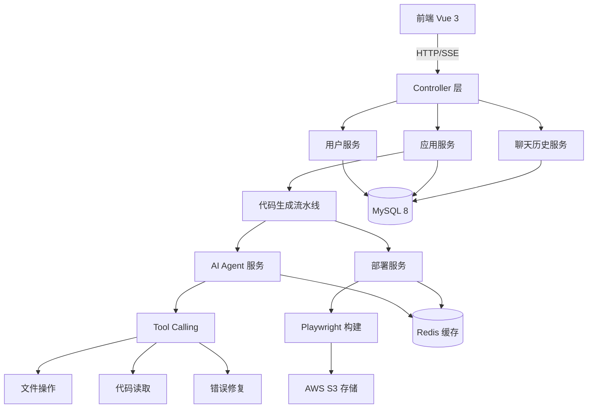
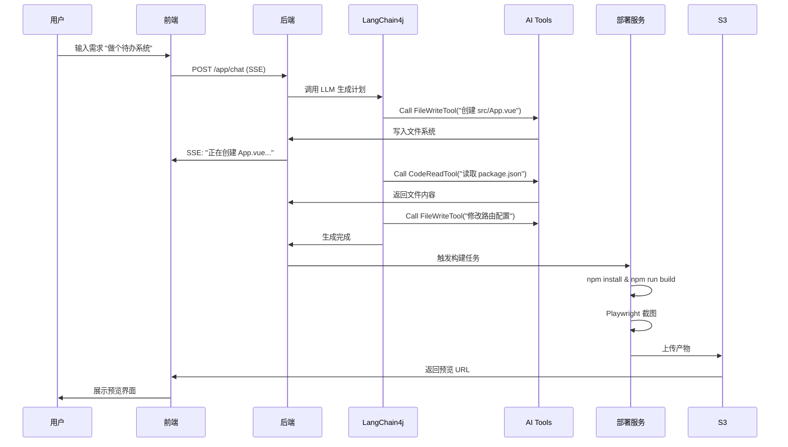

<div align="center">

# 🚀 Zriyo AI Code Mother

**下一代 AI 原生应用开发平台 · 零代码全栈生成引擎**

[](LICENSE)
[](https://openjdk.org/)
[](https://spring.io/projects/spring-boot)
[](https://github.com/langchain4j/langchain4j)

[📖 文档](#-快速开始) · [✨ 特性](#-核心特性) · [🏗️ 架构](#️-技术架构) · [🤝 贡献](#-参与贡献)

</div>

---

## 💡 项目简介

**Zriyo AI Code Mother** 是一个革命性的 **Agentic AI 驱动的零代码应用生成平台**。

不同于传统的 Copilot 代码辅助工具，本项目基于 **AI Agent + Tool Calling** 架构，让 AI 真正"接管"软件研发的全生命周期 —— 从需求理解、架构设计、多文件代码生成，到自动化测试、部署上线、版本回滚，全程无需编写代码。

### 📦 相关项目

- **后端项目（本仓库）**：AI 代码生成引擎
- **前端项目**：[zriyo-code-web](https://github.com/zriyox/zriyo-code-web) - Vue 3 用户界面
- **在线演示**：[www.zriyo.com](https://www.zriyo.com) - 立即体验

### 🎯 核心理念

> **"描述即应用"** —— 只需用自然语言描述需求，AI 将自动规划任务、调用工具、生成完整的生产级 Vue 3 项目。

### 🌟 适用场景

- ✅ **快速原型验证**：5 分钟从想法到可交互的 Web 应用
- ✅ **降低开发门槛**：非技术人员也能构建复杂应用
- ✅ **教学演示**：自动生成最佳实践的示例代码
- ✅ **企业级应用**：支持版本管理、部署回滚、积分计费

---

## ✨ 核心特性

### 🔥 1. 企业级流式响应架构 (Resumable SSE)

> **解决痛点**：大模型代码生成耗时长（1-3 分钟），HTTP 连接易断开

采用 **Project Reactor** + **Sinks** 实现断线无感重连。

**技术亮点**：
- 🔄 **断线无感重连**：浏览器刷新或网络抖动后，重新连接即刻推送所有历史日志
- ⚡ **异步流水线**：生成任务在后台线程池运行，不受前端连接状态影响
- 💾 **零数据丢失**：基于内存 Replay 机制，确保流式日志完整性

---

### 🧠 2. AI Agent 智能体架构

#### 核心工具集 (LangChain4j Tools)

| 工具名称 | 功能描述 | 应用场景 |
|---------|---------|---------|
| **FileWriteTool** | 文件创建/修改/删除 | 生成 Vue 组件、配置文件 |
| **CodeReadTool** | 动态读取项目文件 | AI 自主探索代码结构 |
| **RuntimeFixTool** | 运行时错误修复 | 自动分析错误堆栈并修复 |
| **ListDirTool** | 目录结构查询 | 理解项目布局 |
| **CmdExecuteTool** | 命令执行 | npm install、构建打包 |

#### 智能上下文管理

采用 **延迟摘要 + 动态加载** 策略，避免 Token 浪费。

**优势**：
- 📉 Token 节省 60% 以上
- 🎯 上下文精准度提升（去除冗余日志）
- 🚀 生成速度提升 40%

---

### 🏗️ 3. 零代码全栈生成 (Text-to-App)

#### 支持的生成模式

| 模式 | 描述 | 示例 Prompt |
|-----|------|-----------|
| **VUE_PROJECT** | 完整 Vue 3 + Vite 项目 | "帮我做一个待办事项管理系统，支持拖拽排序" |
| **COMPONENT** | 单个 Vue 组件 | "生成一个带动画的卡片组件" |
| **MULTI_FILE** | 多文件代码片段 | "创建一个用户认证模块（含登录/注册页面）" |

#### 生成流水线 (责任链模式)

```
需求分析 → 骨架规划 → 文件创建 → 代码生成 → 依赖安装 → 预览构建 → 部署上线
    ↓           ↓           ↓           ↓           ↓           ↓           ↓
 AI 理解   目录结构   FileWriteTool  LangChain4j  npm install  Playwright   AWS S3
```

**生成质量保障**：
- ✅ **TypeScript 类型安全**：自动生成类型定义
- ✅ **响应式设计**：适配移动端与桌面端
- ✅ **最佳实践**：遵循 Vue 3 Composition API 规范
- ✅ **可扩展性**：支持增量迭代修改

---

### 🔐 4. 企业级版本管理与回滚

每次代码生成会自动创建版本快照，支持一键回滚到任意历史版本。

**技术实现**：
1. 从 S3 下载历史版本代码
2. 解压到项目目录
3. 重新构建 & 部署
4. 更新 `latestDeploymentId` 指针

---

### 🎨 5. 自动化测试与预览

集成 **Playwright** 无头浏览器，生成代码后自动构建、截图并上传预览。

**用户体验**：
- 📸 实时预览生成的应用界面
- 🐛 自动发现运行时错误（通过浏览器 Console 监听）
- 🔄 错误自动反馈给 AI 进行修复

---

### 💰 6. 完整的用户与积分体系

#### 功能模块

| 功能 | 接口 | 说明 |
|-----|------|------|
| **用户注册** | `POST /user/auto/register` | 邮箱验证码注册 |
| **微信登录** | `GET /user/auto/qrcode` | Authing SDK 集成 |
| **积分查询** | `GET /userPoints/get` | 查看当前积分余额 |
| **每日签到** | `GET /userPoints/sign` | 签到获取积分 |
| **CDK 兑换** | `POST /userPoints/exchange` | 兑换码充值积分 |
| **积分流水** | `POST /userPoints/history` | 查看消费/充值记录 |

**扣除规则**：采用乐观锁机制防止并发超扣，所有变动记录流水日志。

---

## 🛠️ 技术架构

### 核心技术栈

| 技术分类 | 技术选型 | 版本 | 应用场景 |
|---------|---------|------|---------|
| **核心框架** | Spring Boot | 3.5.4 | Web 框架基座 |
| **编程语言** | Java | 21 (LTS) | 虚拟线程、Record 等新特性 |
| **响应式编程** | Project Reactor | - | SSE 流式响应 + 异步编排 |
| **AI 引擎** | LangChain4j | 1.1.0 | LLM 调用 + Tool Calling |
| **ORM 框架** | MyBatis-Flex | 1.11.1 | 灵活的 SQL 构建 |
| **数据库** | MySQL | 8.0+ | 主数据存储 |
| **缓存** | Redis + Redisson | - | 分布式锁 + 缓存 |
| **权限认证** | Sa-Token | 1.44.0 | JWT + 微信登录 |
| **无头浏览器** | Playwright | 1.40.0 | 自动化构建 + 截图 |
| **对象存储** | AWS S3 SDK | 2.25.27 | 代码归档 + 静态资源 |
| **监控** | Spring Actuator + Prometheus | - | 系统指标监控 |

### 系统架构图



### 核心流程时序图



---

## 📂 项目结构

```
zriyo-ai-code-mother/
├── src/main/java/com/zriyo/aicodemother/
│   ├── ai/                          # AI 核心模块
│   │   ├── factory/                 # AI 服务工厂
│   │   ├── tools/                   # AI 工具集
│   │   │   ├── FileWriteTool.java   # 文件操作工具
│   │   │   ├── CodeReadTool.java    # 代码读取工具
│   │   │   └── RuntimeFixTool.java  # Bug 修复工具
│   │   └── service/                 # AI 代码生成服务
│   │
│   ├── controller/                  # REST API 控制器
│   │   ├── AppController.java       # 应用管理（创建/删除/部署）
│   │   ├── UserController.java      # 用户认证（注册/登录）
│   │   ├── UserPointsController.java # 积分管理（签到/兑换）
│   │   ├── ChatHistoryController.java # 聊天历史查询
│   │   ├── DeploymentHistoryController.java # 部署历史
│   │   └── Admin/                   # 管理后台接口
│   │
│   ├── core/                        # 核心引擎
│   │   ├── pipeline/                # 代码生成流水线
│   │   │   ├── handler/             # 流水线处理器
│   │   │   │   ├── SkeletonHandler.java      # 骨架生成
│   │   │   │   ├── FileCreationHandler.java  # 文件创建
│   │   │   │   ├── CodeGenHandler.java       # 代码生成
│   │   │   │   └── BuildHandler.java         # 构建打包
│   │   │   └── CodeGenPipelineBuilder.java  # 流水线构建器
│   │   ├── parser/                  # 代码解析器
│   │   └── saver/                   # 代码保存器
│   │
│   ├── service/                     # 业务服务层
│   │   ├── impl/
│   │   │   ├── AppServiceImpl.java          # 应用业务逻辑
│   │   │   ├── UserServiceImpl.java         # 用户业务逻辑
│   │   │   ├── ChatHistoryServiceImpl.java  # 聊天历史
│   │   │   └── DeploymentHistoryServiceImpl.java
│   │   └── email/                   # 邮件服务
│   │
│   ├── model/                       # 数据模型
│   │   ├── entity/                  # 数据库实体
│   │   │   ├── User.java
│   │   │   ├── App.java
│   │   │   ├── ChatHistory.java
│   │   │   ├── UserPoints.java
│   │   │   └── DeploymentHistory.java
│   │   ├── dto/                     # 数据传输对象
│   │   ├── vo/                      # 视图对象
│   │   └── enums/                   # 枚举类型
│   │
│   ├── mapper/                      # MyBatis-Flex Mapper
│   ├── config/                      # 配置类
│   │   ├── RedisConfig.java
│   │   ├── S3Config.java
│   │   └── SaTokenConfig.java
│   ├── exception/                   # 异常处理
│   ├── util/                        # 工具类
│   └── wechatlogin/                 # 微信登录集成
│
├── src/main/resources/
│   ├── prompt/                      # AI Prompt 模板
│   │   ├── codegen-vue-project-prompt.txt    # Vue 项目生成
│   │   ├── vue3_prompt_optimizer.txt         # Prompt 优化
│   │   └── investigation-prompt.txt          # 需求调研
│   ├── application.yml              # 配置文件（需自行创建）
│   └── application-template.yml     # 配置模板
│
├── sql/                             # 数据库脚本
│   ├── zriyo_ai_code_mother.sql     # 完整建表脚本
│   └── split/                       # 分库脚本（微服务准备）
│
├── docs/                            # 项目文档
│   ├── phase1_infrastructure.md     # 基础设施搭建
│   ├── phase2_code_structure.md     # 代码结构说明
│   └── MICROSERVICE_DESIGN.md       # 微服务拆分方案
│
└── tmp/code_output/                 # 生成代码输出目录
    ├── code_deploy/                 # 部署产物
    ├── code_version/                # 版本归档
    └── config/                      # 配置文件
```

---

## 🚀 快速开始

### 环境要求

| 软件 | 版本要求 | 说明 |
|-----|---------|------|
| JDK | 21+ | 使用 OpenJDK 或 Oracle JDK |
| Maven | 3.8+ | 构建工具 |
| MySQL | 8.0+ | 数据库 |
| Redis | 6.0+ | 缓存与分布式锁 |
| Node.js | 18+ | Playwright 依赖 |

### 安装步骤

#### 1️⃣ 克隆项目

```bash
git clone https://github.com/your-org/zriyo-ai-code-mother.git
cd zriyo-ai-code-mother
```

#### 2️⃣ 初始化数据库

```bash
# 创建数据库
mysql -u root -p -e "CREATE DATABASE zriyo_ai_code_mother CHARACTER SET utf8mb4 COLLATE utf8mb4_unicode_ci;"

# 导入表结构
mysql -u root -p zriyo_ai_code_mother < sql/zriyo_ai_code_mother.sql
```

#### 3️⃣ 配置文件

复制模板并修改配置：

```bash
cp src/main/resources/application-template.yml src/main/resources/application.yml
```

**关键配置项**：

```yaml
# OpenAI API 配置
langchain4j:
  open-ai:
    chat-model:
      api-key: "sk-your-openai-api-key"  # ⚠️ 必填
      base-url: "https://api.openai.com/v1"
      model-name: "gpt-4o"
      temperature: 0.2

# MySQL 配置
spring:
  datasource:
    url: jdbc:mysql://localhost:3306/zriyo_ai_code_mother?useUnicode=true&characterEncoding=utf-8
    username: root
    password: your_password  # ⚠️ 修改为实际密码

# Redis 配置
spring:
  data:
    redis:
      host: localhost
      port: 6379
      password:  # 如有密码请填写

# AWS S3 配置（可选，用于部署功能）
aws:
  s3:
    access-key: your_access_key
    secret-key: your_secret_key
    region: us-east-1
    bucket-name: zriyo-code-deploy

# 代码输出目录
app:
  code-output-path: ./tmp/code_output  # 生成代码存放路径
```

#### 4️⃣ 安装 Playwright（用于自动化构建）

```bash
# 安装 Playwright 浏览器
mvn exec:java -e -D exec.mainClass=com.microsoft.playwright.CLI -D exec.args="install chromium"
```

#### 5️⃣ 启动项目

```bash
# 使用 Maven 启动
mvn spring-boot:run

# 或使用 IDE 直接运行 ZriyoAiCodeMotherApplication.java
```

#### 6️⃣ 验证启动

访问健康检查接口：

```bash
curl http://localhost:8080/actuator/health
# 预期返回：{"status":"UP"}
```

---

## 📖 API 文档

### 核心接口列表

#### 应用管理

| 接口 | 方法 | 描述 | 认证 |
|-----|------|------|------|
| `/api/app/add` | POST | 创建新应用 | ✅ |
| `/api/app/delete/{id}` | DELETE | 删除应用 | ✅ |
| `/api/app/list/my` | POST | 查询我的应用列表 | ✅ |
| `/api/app/chat` | POST (SSE) | 对话式代码生成 | ✅ |
| `/api/app/deploy` | POST | 部署应用 | ✅ |
| `/api/app/rollback` | POST | 回滚到历史版本 | ✅ |
| `/api/app/download` | GET | 下载源代码 | ✅ |

#### 用户认证

| 接口 | 方法 | 描述 | 认证 |
|-----|------|------|------|
| `/user/auto/register` | POST | 用户注册 | ❌ |
| `/user/auto/login` | POST | 用户登录 | ❌ |
| `/user/auto/get/login` | GET | 获取当前用户信息 | ✅ |
| `/user/auto/logout` | POST | 退出登录 | ✅ |
| `/user/auto/qrcode` | GET | 获取微信登录二维码 | ❌ |

#### 积分系统

| 接口 | 方法 | 描述 | 认证 |
|-----|------|------|------|
| `/userPoints/get` | GET | 查询积分余额 | ✅ |
| `/userPoints/sign` | GET | 每日签到 | ✅ |
| `/userPoints/exchange` | POST | CDK 兑换积分 | ✅ |
| `/userPoints/history` | POST | 积分流水查询 | ✅ |

#### 聊天历史

| 接口 | 方法 | 描述 | 认证 |
|-----|------|------|------|
| `/chatHistory/list` | GET | 查询对话历史 | ✅ |
| `/chatHistory/toolLog` | GET | 查询 AI 工具调用日志 | ✅ |


---

## 🗄️ 数据库设计

### 核心表结构

#### `app` - 应用表

| 字段 | 类型 | 说明 |
|-----|------|------|
| `id` | BIGINT | 主键 |
| `appName` | VARCHAR(256) | 应用名称 |
| `initPrompt` | TEXT | 初始化需求描述 |
| `codeGenType` | VARCHAR(64) | 代码生成类型（VUE_PROJECT/COMPONENT） |
| `deployKey` | VARCHAR(64) | 部署唯一标识 |
| `latestDeploymentId` | BIGINT | 最新部署版本 ID |
| `userId` | BIGINT | 创建用户 ID |

#### `chat_history` - 对话历史表

| 字段 | 类型 | 说明 |
|-----|------|------|
| `id` | BIGINT | 主键 |
| `message` | TEXT | 消息内容 |
| `messageType` | VARCHAR(32) | 消息类型（USER/AI/TOOL） |
| `appId` | BIGINT | 关联应用 ID |
| `userId` | BIGINT | 用户 ID |
| `user_visible` | TINYINT | 是否对用户可见 |

#### `ai_tool_log` - AI 工具调用日志表

| 字段 | 类型 | 说明 |
|-----|------|------|
| `id` | BIGINT | 主键 |
| `ai_message_id` | BIGINT | 关联的 AI 消息 ID |
| `tool_name` | VARCHAR(50) | 工具名称（writeFile/readFile） |
| `file_path` | VARCHAR(500) | 操作的文件路径 |
| `action` | VARCHAR(50) | 执行动作 |
| `summary` | TEXT | 操作摘要 |
| `cost_time` | BIGINT | 耗时（毫秒） |

#### `user_points` - 用户积分表

| 字段 | 类型 | 说明 |
|-----|------|------|
| `user_id` | BIGINT | 用户 ID（主键） |
| `total_points` | INT | 累计获得总积分 |
| `available_points` | INT | 当前可用积分 |
| `used_points` | INT | 已使用积分 |
| `version` | INT | 乐观锁版本号 |

完整建表脚本见：[sql/zriyo_ai_code_mother.sql](sql/zriyo_ai_code_mother.sql)

---

## 🔧 配置说明

### AI 模型配置

支持 OpenAI 及兼容 OpenAI 的 LLM 提供商（DeepSeek、通义千问等），在 `application.yml` 中配置 `langchain4j.open-ai` 即可。

推荐模型：`gpt-4o`（代码生成质量最佳）

---

## 📊 监控与运维

### Actuator 端点

访问 `http://localhost:8080/actuator` 查看所有端点：

| 端点 | 描述 |
|-----|------|
| `/actuator/health` | 健康检查 |
| `/actuator/metrics` | 系统指标 |
| `/actuator/prometheus` | Prometheus 监控数据 |
| `/actuator/logfile` | 日志文件 |

**Grafana 仪表盘**：集成 Prometheus + Grafana 可监控 JVM 堆内存、HTTP QPS、数据库连接池、AI 调用耗时等指标。

---

## 🚢 部署指南

### Docker 部署

```bash
mvn clean package -DskipTests
docker build -t zriyo-ai-code-mother:latest .
docker run -d -p 8080:8080 \
  -e SPRING_DATASOURCE_URL=jdbc:mysql://host.docker.internal:3306/zriyo_ai_code_mother \
  -e LANGCHAIN4J_OPENAI_API_KEY=sk-xxx \
  zriyo-ai-code-mother:latest
```

### Kubernetes 部署

支持 K8s 部署，提供完整的 `Deployment` 配置。详见项目 `docs/` 目录。

---

## 🤝 参与贡献

欢迎贡献代码、提交 Issue 或改进文档！

### 贡献流程

1. Fork 本仓库
2. 创建特性分支 (`git checkout -b feature/AmazingFeature`)
3. 提交更改 (`git commit -m 'Add some AmazingFeature'`)
4. 推送到分支 (`git push origin feature/AmazingFeature`)
5. 提交 Pull Request

### 开发规范

- ✅ 遵循阿里巴巴 Java 开发手册
- ✅ 使用 **Lombok** 简化代码
- ✅ 单元测试覆盖率 > 60%
- ✅ 提交信息遵循 [Conventional Commits](https://www.conventionalcommits.org/)

---

## 📄 许可证

本项目采用 [MIT License](LICENSE) 开源协议。

---

## 🙏 鸣谢

- [LangChain4j](https://github.com/langchain4j/langchain4j) - Java LLM 框架
- [MyBatis-Flex](https://mybatis-flex.com/) - 优雅的 ORM 框架
- [Sa-Token](https://sa-token.cc/) - 轻量级权限认证框架
- [Playwright](https://playwright.dev/) - 现代化自动化测试工具

---

## 📮 联系方式

- **作者**：zriyo
- **邮箱**：zriy@foxmail.com
- **项目主页**：https://github.com/zriyox/zriyo-ai-code-mother.git
- **在线演示**：https://www.zriyo.com

---

<div align="center">

**⭐ 如果这个项目对你有帮助，请给一个 Star！**

Made with ❤️ by Zriyo Team

</div>
